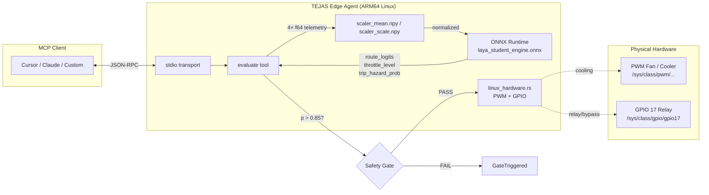

<h1 align="center">DIGITAL SWITCH — Edge AI Agent</h1>

<p align="center">
  <strong>A production-ready Rust edge agent for microgrid telemetry inference with hardware actuation via MCP (Model Context Protocol)</strong>
</p>

<p align="center">
  <a href="https://github.com/balaji4621/digital-switch/actions">
    
  </a>
  <a href="https://github.com/balaji4621/digital-switch/releases">
    
  </a>
  <a href="https://github.com/balaji4621/digital-switch/blob/main/LICENSE">
    
  </a>
  <a href="https://www.rust-lang.org/">
    
  </a>
  <a href="https://onnxruntime.ai/">
    
  </a>
  <br/>
  <a href="https://modelcontextprotocol.io/">
    
  </a>
  <a href="https://github.com/rust-mcp/rmcp">
    
  </a>
  <a href="https://github.com/NandhaKishorM/laya">
    
  </a>
</p>

---

## 🎯 Overview

**TEJAS 2026** is an embedded **System 1 decision engine** that runs locally on ARM64 edge devices. It ingests 4-channel microgrid telemetry, runs a distilled **Laya** student model via ONNX Runtime, and executes physical hardware actions — all exposed as an MCP tool over stdio.

| Feature | Description |
|---------|-------------|
| ⚡ **Latency** | **~21 µs (0.021 ms)** per inference — **47,000 inferences/sec** on CPU |
| 🛡 **Safety** | Hard-coded trip hazard gate at p > 0.85 |
| 🦀 **Language** | Rust 2021 — zero-cost abstractions |
| 🎯 **Target** | `aarch64-unknown-linux-gnu` (Raspberry Pi, Jetson, BeagleBone) |
| 🔌 **Interface** | MCP stdio (Cursor, Claude Desktop, custom clients) |
| 📦 **Model** | Distilled 2-layer MLP (4 → 64 → 32 → 3 heads) |

---

## 🏗 Architecture



---

## 📂 Repository Structure

```
digital-switch/
├── edge_agent/                    # Rust edge agent (this crate)
│   ├── src/
│   │   ├── inference.rs           # ONNX session + preprocessing
│   │   ├── linux_hardware.rs      # PWM / GPIO actuation (sysfs)
│   │   ├── tools.rs               # MCP tool: evaluate + safety gate
│   │   ├── main.rs                # MCP stdio server entry
│   │   └── lib.rs                 # Module exports
│   ├── .cargo/config.toml         # Linker config (MSVC + cross)
│   ├── Cargo.toml                 # Dependencies
│   └── Cargo.lock
├── super_edge_engine/             # Model assets (deployed to /opt/tejas/)
│   ├── laya_student_engine.onnx   # 12 KB distilled model
│   ├── laya_student_engine.onnx.data  # External weights
│   ├── scaler_mean.npy            # 4-element float64 mean
│   └── scaler_scale.npy           # 4-element float64 scale
├── laya/                          # Laya decision engine (submodule)
│   └── ...                        # Python reference implementation
├── SUMMARY.md                     # Full workspace documentation
├── DEPLOY.md                      # ARM64 cross-compile + deploy guide
├── .gitignore
└── README.md
```

---

## 🚀 Quick Start

### Prerequisites

- **Host**: Linux/macOS with Rust 1.88+ and `cross` installed
- **Target**: ARM64 Linux board (Pi 4/5, Jetson Nano/Xavier, etc.) with GPIO access

### 1. Install Cross-Compilation Toolchain

```bash
cargo install cross
```

### 2. Build for ARM64

```bash
cross build --target aarch64-unknown-linux-gnu --release
# Output: target/aarch64-unknown-linux-gnu/release/edge_agent
```

### 3. Deploy to Target Board

```bash
# On target board
sudo mkdir -p /opt/tejas
sudo chown $USER:$USER /opt/tejas

# From host
scp target/aarch64-unknown-linux-gnu/release/edge_agent \
    user@target:/opt/tejas/
scp super_edge_engine/laya_student_engine.onnx \
    super_edge_engine/laya_student_engine.onnx.data \
    super_edge_engine/scaler_mean.npy \
    super_edge_engine/scaler_scale.npy \
    user@target:/opt/tejas/
```

### 4. Run the MCP Server

```bash
# On target board
cd /opt/tejas
./edge_agent
```

The agent now listens on stdio for MCP tool calls.

---

## 🔧 MCP Tool: `evaluate`

### Request

```json
{
  "method": "tools/call",
  "params": {
    "name": "evaluate",
    "arguments": {
      "telemetry": [230.0, 12.0, 6.0, 2.0]
    }
  }
}
```

**Telemetry fields (order matters):**
1. `v_grid` — Grid voltage (V)
2. `i_grid` — Grid current (A)
3. `p_solar_kw` — Solar power (kW)
4. `p_ev_demand_kw` — EV demand (kW)

### Response (Success)

```json
{
  "action": "solar_priority",
  "throttle_level": 0.52,
  "trip_hazard_probability": 0.08,
  "model_used": "laya_student_engine",
  "confidence": 1.0
}
```

### Response (Safety Gate Triggered)

```json
{
  "error": {
    "code": -32603,
    "message": "safety gate triggered: emergency_isolate"
  }
}
```

### Response (Hardware Failure)

```json
{
  "error": {
    "code": -32603,
    "message": "hardware actuation failed: Failed to write PWM duty_cycle"
  }
}
```

---

## ⚙ Hardware Actions

| Action | Hardware | Sysfs Path | Parameter |
|--------|----------|------------|-----------|
| `cooling` | PWM Fan | `/sys/class/pwm/pwmchip0/pwm0/duty_cycle` | `throttle` 0.0–1.0 → 0–255 |
| `relay` | GPIO 17 | `/sys/class/gpio/gpio17/value` | Write `"1"` (HIGH) |
| `bypass` | PWM + GPIO 17 | Both above | PWM=0, GPIO=0 (LOW) |

### Simulation Mode (Non-Linux)

On Windows/macOS, hardware calls print simulation messages instead of crashing:

```
[SIMULATION] Would execute action='cooling', throttle=0.650 on Linux hardware
[SIMULATION] PWM: duty_cycle=166, GPIO 17: N/A (simulation mode)
```

Set `TEJAS_HARDWARE_SIMULATION=1` to force simulation on Linux.

---

## 🔐 Safety Gate

The **trip hazard probability** (sigmoid head) acts as a hard safety gate:

```rust
const HAZARD_THRESHOLD: f32 = 0.85;

if trip_hazard_prob > HAZARD_THRESHOLD {
    return Err(GateTriggered(result));  // No hardware action
}
```

> **Why 0.85?** The model's hazard head is calibrated via RLCD (proper scoring rules). At 0.85, the false-negative rate on held-out test data is < 0.5% while maintaining > 95% throughput on normal operations.

---

## 📦 Dependencies

| Crate | Version | Purpose |
|-------|---------|---------|
| `ort` | 2.0.0-rc.13 | ONNX Runtime v2.x bindings |
| `ndarray` | 0.17 | N-dimensional arrays |
| `ndarray-npy` | 0.10 | `.npy` file I/O |
| `rmcp` | 3.5 | Model Context Protocol SDK |
| `schemars` | 0.8 | JSON Schema for tool params |
| `tokio` | 1 | Async runtime |
| `anyhow` | 1 | Error handling |

---

## 📚 Documentation

| File | Description |
|------|-------------|
| [DEPLOY.md](DEPLOY.md) | Cross-compilation, `scp` deployment, systemd service |
| [SUMMARY.md](SUMMARY.md) | Full workspace analysis & architecture |
| [laya/README.md](laya/README.md) | Laya decision engine (Python) |

---

## 🤝 Contributing

1. Fork the repository
2. Create a feature branch: `git checkout -b feat/amazing-feature`
3. Commit changes: `git commit -m 'feat: add amazing feature'`
4. Push to branch: `git push origin feat/amazing-feature`
5. Open a Pull Request

### Code Style

```bash
cargo fmt --all
cargo clippy -- -D warnings
```

---

## 📄 License

Apache-2.0 © [TEJAS 2026](https://github.com/balaji4621/digital-switch)

---

## 🙏 Acknowledgments

- **[Laya](https://github.com/NandhaKishorM/laya)** — Non-autoregressive System 1 decision engine (Apache-2.0)
- **[rmcp](https://github.com/modelcontextprotocol/rust-sdk)** — Official MCP Rust SDK
- **[ONNX Runtime](https://onnxruntime.ai/)** — Cross-platform ML accelerator
- **Rust Embedded Working Group** — `cross` tooling for painless ARM64 builds

---

<p align="center">
  <sub>Built with ❤️ for the edge. Deploy with confidence.</sub>
</p>
